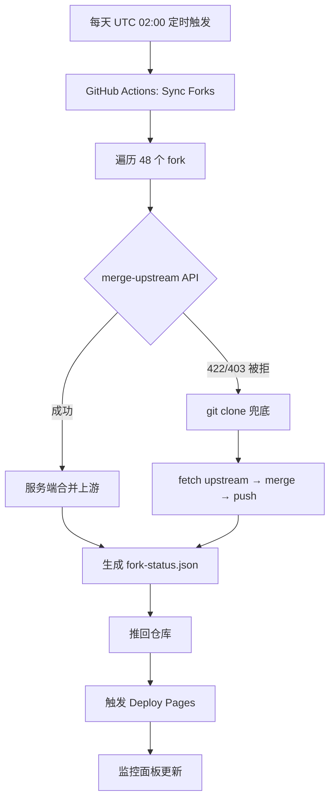

# 把个人主页变成自动化的个人工作站

> 建站第一天，先讲讲这个站是怎么来的。

## 缘起：从"展示"到"工作"

以前我的 GitHub 主页只有一句话：*Android 内核构建 · 开源折腾者*。

我 fork 了 48 个上游项目（内核、Root 方案、CI 工具链……），其中不少需要长期跟进上游更新。每次都要手动去点网页上的 **Sync fork** 按钮，点完还要看有没有冲突——48 个仓库，一天点一轮，纯体力活。

所以这个站的定位从一开始就不是"个人名片"，而是一个**工作站**：

- 首页实时展示 GitHub 动态，push 了新仓库自动更新
- **48 个 fork 每天自动同步上游**，不用再手动点按钮
- 一个监控面板，一眼看清每个 fork 的同步状态
- 博客随写随发，把折腾过程沉淀下来

## 技术选型

:::tabs
== VitePress ==
最终选择。Markdown 写作 + Vue 组件扩展（GitHub 动态、监控面板都能写成组件），零配置本地搜索，构建产物是纯静态文件，托管在 GitHub Pages 上零成本。

== Hugo ==
Go 写的，构建极快，主题生态成熟。但对我来说自定义组件（比如拉取 GitHub API 的实时面板）不如 Vue 顺手，模板语言也要重新学。

== 手写 HTML ==
最自由但也最累：每次更新都要维护 HTML，没有搜索、没有组件、没有自动部署的爽感。适合静态名片，不适合"工作站"。
:::

部署方面没纠结：GitHub Pages + GitHub Actions 全自动，push 即上线，`sunsetrne.github.io` 这个域名就是 GitHub 给的。

## 核心：Fork 自动同步系统

整个站最"重"的部分不是页面，而是这套同步系统：

几个关键设计：

- **API 优先，clone 兜底**：大多数仓库走 GitHub 官方 `merge-upstream` API（等同于网页上点 Sync fork），几秒钟完成；只有 API 拒绝时才降级到完整 git clone 流程[^1]
- **4 路并行 + 部分克隆**：48 个仓库并行处理，磁盘占用用 partial clone 控制
- **报告驱动页面**：同步结果写入 `fork-status.json` 推回仓库，监控面板同域读取，不碰 API 限流问题

## 踩坑实录

建站过程比想象中曲折，最有价值的都在这了：

- [x] **SSH 走 443 端口**：`ssh.github.com:443` 隧道，网络环境受限也能 push
- [x] **Actions 里 push 不触发 workflow**：GitHub 的递归防护——用 GITHUB_TOKEN push 不会触发其他 workflow。解法：显式清除 `extraheader`，用 SYNC_TOKEN 认证 push，再显式 dispatch 一次 Deploy Pages
- [x] **fine-grained token 没有 Actions 权限**：dispatch 时用 `GITHUB_TOKEN`，不能用个人 token（会 403）
- [x] **"对象库损坏"惊魂**：本地 `.git` 里 209 个对象突然全部 `mmap` 失败，`git fetch` 直接崩。排查后发现是工作区重命名后，符号链接还指向旧路径——对象没丢，是链接断了[^2]。最终用远程克隆重建 `.git`，工作区文件一个没动
- [ ] RSS 订阅（等文章多起来再说）
- [ ] 内核构建器 `oppo_oplus_realme` 的拆解文

## 现在的样子

这个站现在跑着这些插件：

| 类别 | 插件 | 用途 |
| --- | --- | --- |
| 搜索 | VitePress 内置 local search | 全站全文搜索 |
| 写作 | markdown-it-footnote / task-lists / katex | 脚注、任务列表、数学公式 |
| 图表 | vitepress-plugin-mermaid | 架构图（本文的流程图就是） |
| 阅读 | enhanced-readabilities / lightbox / tabs | 字号调节、图片放大、选项卡 |
| 历史 | git-changelog | 文章更新记录 |

## 结尾

第一篇写"这个站怎么来的"，是因为折腾的过程本身值得记录——尤其是踩坑的部分，说不定哪天能帮到另一个想建站的人[^3]。

接下来准备写：内核自动构建器是怎么把"下载源码 → 打补丁 → 编译 → 发布"全链路自动化的。如果这篇对你有用，欢迎去 [GitHub](https://github.com/SunsetRNE) 围观。

[^1]: API 优先的设计参考了 GitHub 官方 Sync fork 的实现：服务端合并，无需本地 clone，48 个仓库全量同步只要几分钟。
[^2]: 完整的排查过程：`git fsck` 报大量 missing blob → 检查发现 `.git/objects` 下是符号链接 → 指向的旧工作区 UUID 已不存在 → 远程 clone 重建 `.git`，`fsck` 0 错误。
[^3]: 本博客由 VitePress 驱动，源码在 [SunsetRNE.github.io](https://github.com/SunsetRNE/SunsetRNE.github.io)，欢迎提 issue 交流。
